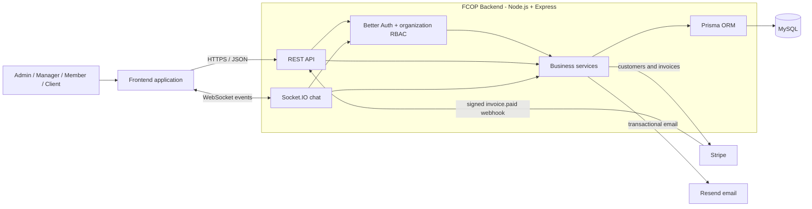
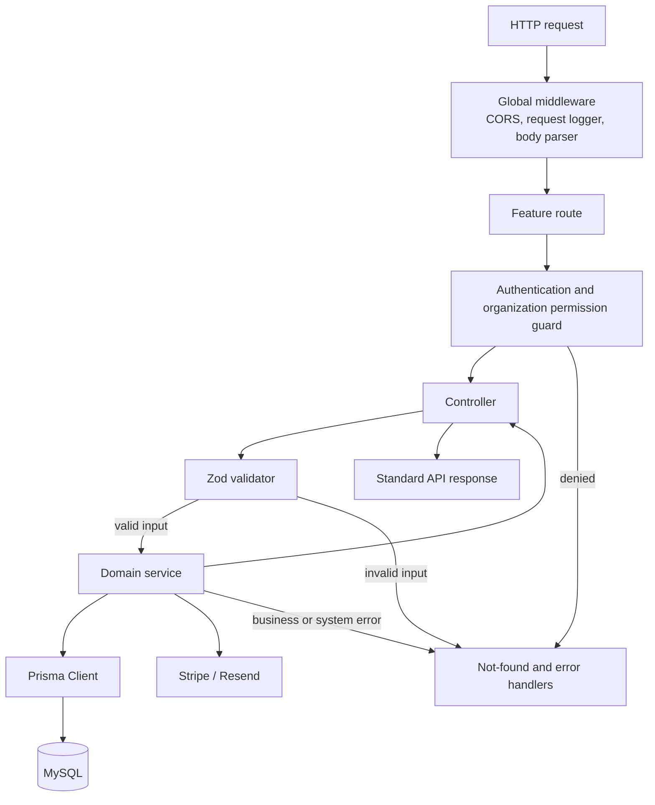
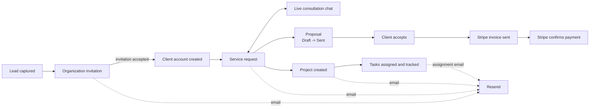
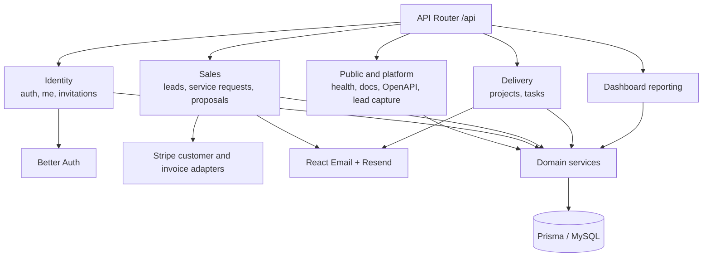
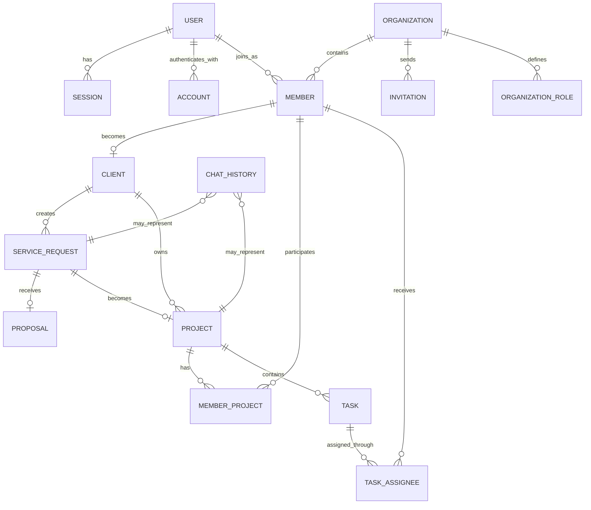
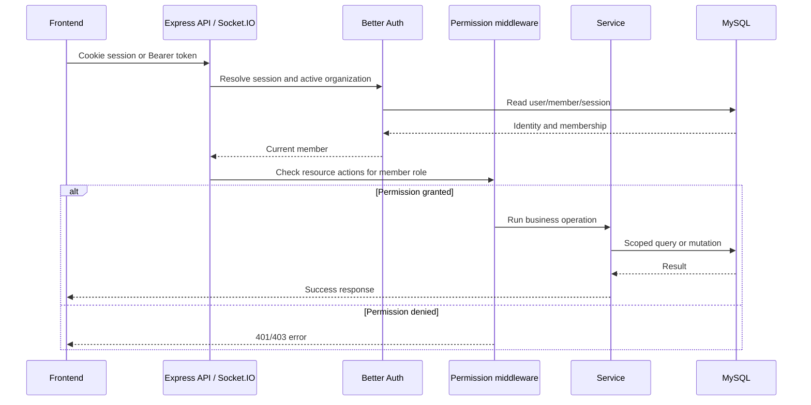
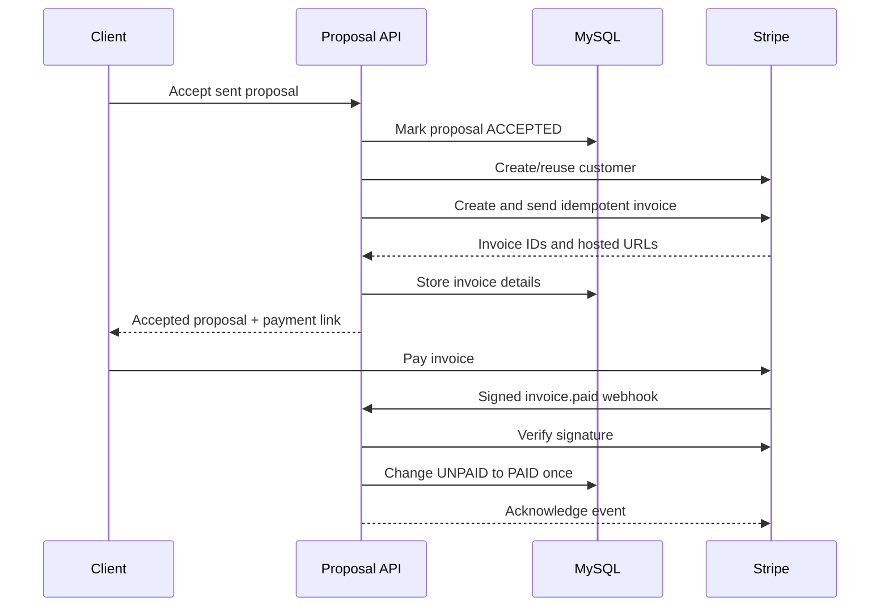
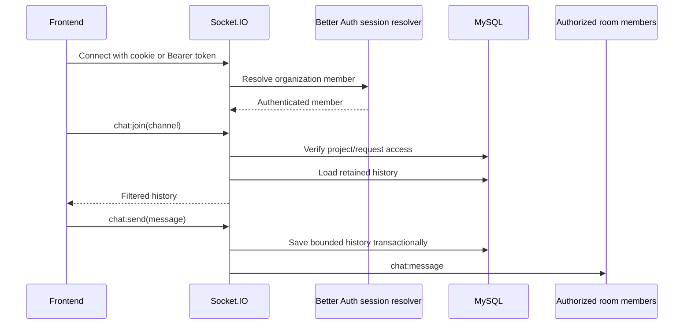

# FCOP Backend Architecture

## Architecture documents

- **High-Level Design (current document):** system context, major components, and business flows
- **[Low-Level Design](./LOW_LEVEL_DESIGN.md):** routes, code layers, permissions, validation, state rules, and integration behavior

## 1. System overview

FCOP is a modular Express.js backend for managing the journey from lead capture to paid project delivery. It exposes REST APIs for business operations and Socket.IO for live chat.

## 2. Internal request architecture

The project uses a layered design. Routes define endpoints and permission requirements. Controllers validate input and translate HTTP concerns. Services enforce business rules and coordinate database or external-provider work.

Typical code path:

`route -> permission middleware -> controller -> Zod validation -> service -> Prisma/external provider -> response`

## 3. Business workflow

Important rules:

- Accepting an invitation creates a client profile and marks a matching lead as qualified.
- Each service request can have at most one proposal and one linked project.
- Only a client can accept a sent proposal.
- Accepted proposal terms become immutable.
- Proposal acceptance creates or reuses a Stripe customer and sends an invoice.
- A verified `invoice.paid` webhook marks the proposal as paid idempotently.
- Project chat follows project access; service-request chat is restricted to the client and administrators.
- Internal chat messages are visible only to management.

## 4. Main backend modules

Primary API groups:

| Area              | Base path                               | Purpose                                      |
| ----------------- | --------------------------------------- | -------------------------------------------- |
| Better Auth       | `/api/auth/*`                           | Better Auth session and account endpoints    |
| Auth helpers      | `/api/v1/auth`                          | Password-reset helper flow                   |
| Invitations       | `/api/v1/invitations`                   | Invite organization members/clients          |
| Leads             | `/api/v1/leads`                         | Capture and manage prospective clients       |
| Current user      | `/api/v1/me`                            | Return current member, role, and permissions |
| Service requests  | `/api/v1/service-requests`              | Manage client service demand                 |
| Proposals         | `/api/v1/service-requests/:id/proposal` | Commercial terms and client acceptance       |
| Projects          | `/api/v1/projects`                      | Project lifecycle and membership             |
| Project tasks     | `/api/v1/projects/:id/tasks`            | Create and list project tasks                |
| Tasks             | `/api/v1/tasks`                         | Cross-project task listing and task updates  |
| Dashboard         | `/api/v1/dashboard`                     | Operational summaries and attention lists    |
| Stripe webhook    | `/api/v1/stripe/webhooks`               | Verify Stripe events and record payment      |
| API documentation | `/api/docs`, `/api/openapi.json`        | Interactive docs and OpenAPI contract        |

## 5. Core data model

This diagram intentionally shows business relationships rather than every column.

`ChatHistory` uses `channelType + channelId`, so its service-request/project relationships are logical rather than database foreign keys.

## 6. Authentication and authorization

Roles are organization-scoped: `ADMIN`, `MANAGER`, `MEMBER`, and `CLIENT`. Services add ownership and project-access checks where role permissions alone are insufficient.

## 7. Stripe payment sequence

The Stripe webhook route is mounted before `express.json()` because signature verification requires the original raw request body.

## 8. Live-chat sequence

Chat history has configurable retention and maximum-message limits. Expired histories are removed when read.

## 9. Short explanation script

> FCOP backend is a modular Node.js and Express application. The frontend uses REST APIs for normal business operations and Socket.IO for live chat. Every protected request is resolved through Better Auth, an active organization, and role-based permissions. Routes call controllers, controllers validate inputs with Zod, and services enforce business rules before accessing MySQL through Prisma. The main business journey starts with a lead, continues through invitation and client onboarding, then service request, proposal, Stripe invoice and payment, and finally project and task delivery. Resend handles transactional emails, while signed Stripe webhooks keep payment status synchronized. The application is deployed as one backend process, but its feature modules and layers keep responsibilities separated.

## 10. Technology summary

| Concern                          | Technology                                     |
| -------------------------------- | ---------------------------------------------- |
| Runtime                          | Node.js 22+ and TypeScript                     |
| HTTP server                      | Express 4 on Node HTTP server                  |
| Real-time communication          | Socket.IO                                      |
| Authentication and organizations | Better Auth                                    |
| Authorization                    | Organization RBAC plus ownership/access checks |
| Validation                       | Zod                                            |
| Database                         | MySQL                                          |
| ORM                              | Prisma 7 with MariaDB adapter                  |
| Payments                         | Stripe invoices and signed webhooks            |
| Email                            | React Email templates and Resend               |
| Logging                          | Pino and pino-http                             |
| API contract                     | OpenAPI with interactive docs                  |
