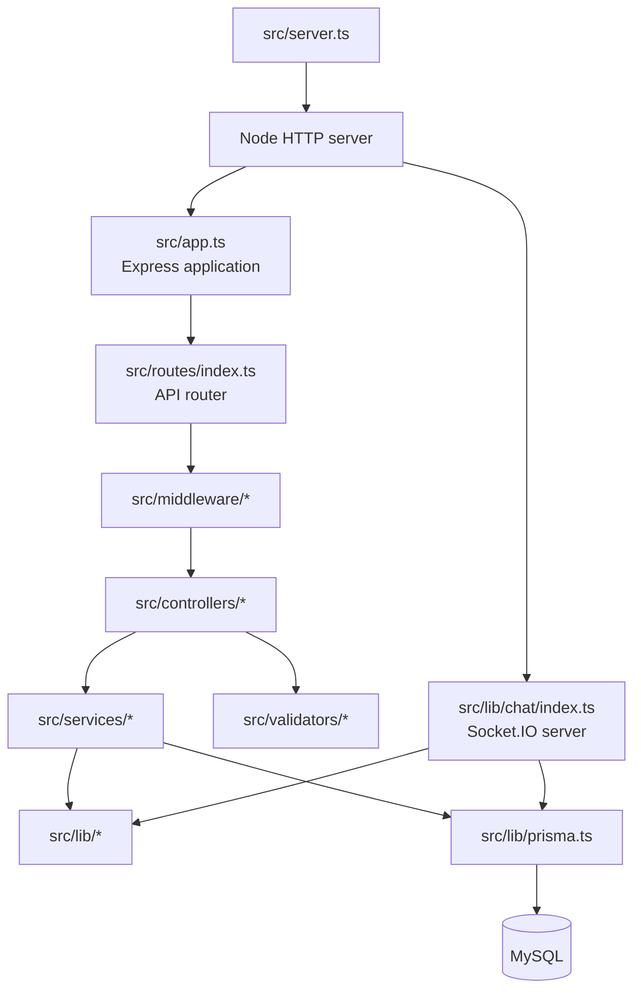
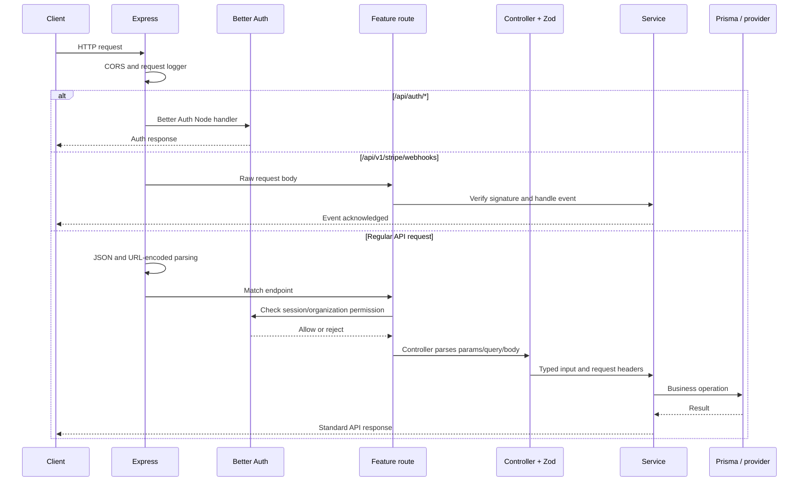
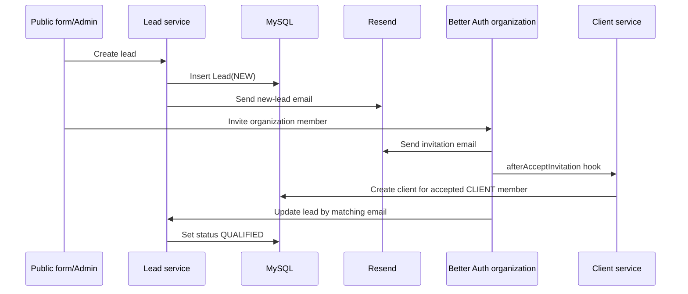
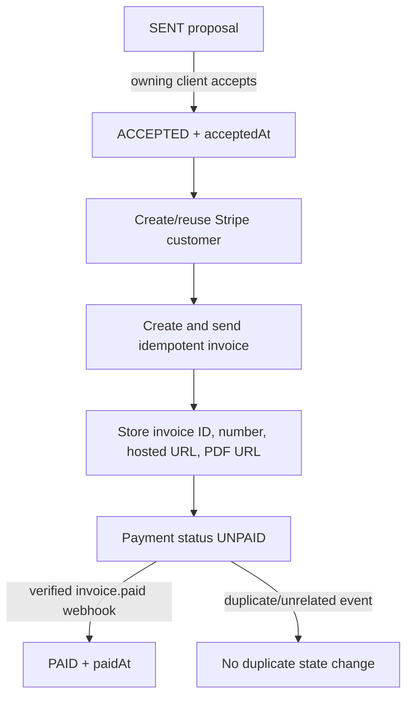
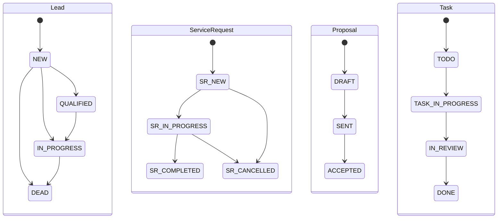

# FCOP Backend Low-Level Design

## Architecture documents

- **[High-Level Design](./ARCHITECTURE.md):** system context, major components, and business flows
- **Low-Level Design (current document):** routes, code layers, permissions, validation, state rules, and integration behavior

## 1. Purpose and scope

This document describes how the FCOP backend is implemented. It complements the HLD by mapping HTTP and Socket.IO entry points to middleware, controllers, validators, services, Prisma models, and external providers.

The OpenAPI contract at `/api/openapi.json` remains the source for complete machine-readable request and response definitions. This document focuses on implementation structure and business behavior.

## 2. Runtime composition



Startup sequence:

1. `server.ts` creates one Node HTTP server from the Express application.
2. `initializeChatServer(server)` attaches Socket.IO to the same server.
3. The server listens on the configured `PORT`.
4. Pino records startup and request logs.

## 3. HTTP processing pipeline

Middleware order matters because each stage prepares data for the next stage.



Actual Express order in `src/app.ts`:

1. CORS
2. Request logger
3. Better Auth handler at `/api/auth/*`
4. Stripe webhook router with raw body
5. JSON and URL-encoded parsers
6. API router
7. Not-found handler
8. Central error handler

The Stripe route must precede `express.json()` because Stripe verifies the signature against the original bytes.

## 4. Layer responsibilities

| Layer       | Directory                     | Responsibility                                                             |
| ----------- | ----------------------------- | -------------------------------------------------------------------------- |
| Entry point | `src/server.ts`, `src/app.ts` | Compose HTTP, Express, Socket.IO, and global middleware                    |
| Routes      | `src/routes`                  | Declare paths, HTTP verbs, nested resources, and permission guards         |
| Middleware  | `src/middleware`              | Authentication, authorization, logging, 404, and error translation         |
| Controllers | `src/controllers`             | Parse requests, invoke validators/services, choose success status/messages |
| Validators  | `src/validators`              | Convert untrusted input into typed Zod payloads                            |
| Services    | `src/services`                | Enforce business rules, ownership, transactions, and side effects          |
| Libraries   | `src/lib`                     | Auth, Prisma, Stripe, email, chat, and logging adapters                    |
| Utilities   | `src/utils`                   | API responses, HTTP errors, roles, pagination, money, and project access   |
| Persistence | `prisma/schema.prisma`        | Models, enums, relations, uniqueness, indexes, and deletion behavior       |

Dependency direction is inward: routes depend on controllers, controllers on validators/services, and services on libraries/Prisma. Services do not depend on Express response objects; they receive typed input and request headers where identity resolution is needed.

## 5. REST endpoint map

`Public` means no FCOP organization permission middleware is attached. Better Auth endpoints can still apply their own authentication rules.

| Method   | Path                                                  | Guard                                          | Controller/action                                   |
| -------- | ----------------------------------------------------- | ---------------------------------------------- | --------------------------------------------------- |
| `GET`    | `/api/health`                                         | Public                                         | Inline health response                              |
| `GET`    | `/api/docs`                                           | Public                                         | Swagger UI                                          |
| `GET`    | `/api/openapi.json`                                   | Public                                         | OpenAPI document                                    |
| `*`      | `/api/auth/*`                                         | Better Auth                                    | Better Auth Node handler                            |
| `POST`   | `/api/v1/auth/request-password-reset`                 | Public                                         | `authController.requestPasswordReset`               |
| `POST`   | `/api/v1/invitations`                                 | `invitation:create`                            | `invitationController.inviteMember`                 |
| `POST`   | `/api/v1/leads`                                       | Public                                         | `leadController.createLead`                         |
| `GET`    | `/api/v1/leads`                                       | `lead:read`                                    | `leadController.getLeads`                           |
| `GET`    | `/api/v1/leads/:id`                                   | `lead:read`                                    | `leadController.getLeadById`                        |
| `PUT`    | `/api/v1/leads/:id`                                   | `lead:update`                                  | `leadController.updateLeadById`                     |
| `DELETE` | `/api/v1/leads/:id`                                   | `lead:delete`                                  | `leadController.deleteLeadById`                     |
| `GET`    | `/api/v1/me`                                          | Authenticated                                  | `meController.getMe`                                |
| `POST`   | `/api/v1/service-requests`                            | `serviceRequest:create`                        | `serviceRequestController.createServiceRequest`     |
| `GET`    | `/api/v1/service-requests`                            | `serviceRequest:read`                          | `serviceRequestController.getServiceRequests`       |
| `GET`    | `/api/v1/service-requests/:id`                        | `serviceRequest:read`                          | `serviceRequestController.getServiceRequestById`    |
| `PUT`    | `/api/v1/service-requests/:id`                        | `serviceRequest:update`                        | `serviceRequestController.updateServiceRequestById` |
| `DELETE` | `/api/v1/service-requests/:id`                        | `serviceRequest:delete`                        | `serviceRequestController.deleteServiceRequestById` |
| `POST`   | `/api/v1/service-requests/:serviceRequestId/proposal` | `proposal:create`                              | `proposalController.createProposal`                 |
| `GET`    | `/api/v1/service-requests/:serviceRequestId/proposal` | `proposal:read`                                | `proposalController.getProposal`                    |
| `PATCH`  | `/api/v1/service-requests/:serviceRequestId/proposal` | `proposal:update`                              | `proposalController.updateProposal`                 |
| `DELETE` | `/api/v1/service-requests/:serviceRequestId/proposal` | `proposal:delete`                              | `proposalController.deleteProposal`                 |
| `POST`   | `/api/v1/service-requests/:serviceRequestId/project`  | `serviceRequest:read/update`, `project:create` | `projectController.createProjectFromServiceRequest` |
| `POST`   | `/api/v1/projects`                                    | `project:create`                               | `projectController.createProject`                   |
| `GET`    | `/api/v1/projects`                                    | `project:read`                                 | `projectController.getProjects`                     |
| `GET`    | `/api/v1/projects/:id`                                | `project:read`                                 | `projectController.getProjectById`                  |
| `PUT`    | `/api/v1/projects/:id`                                | `project:update`                               | `projectController.updateProjectById`               |
| `DELETE` | `/api/v1/projects/:id`                                | `project:delete`                               | `projectController.deleteProjectById`               |
| `POST`   | `/api/v1/projects/:projectId/tasks`                   | `task:create`                                  | `taskController.createTask`                         |
| `GET`    | `/api/v1/projects/:projectId/tasks`                   | `task:read`                                    | `taskController.getProjectTasks`                    |
| `GET`    | `/api/v1/tasks`                                       | `task:read`                                    | `taskController.getTasks`                           |
| `PUT`    | `/api/v1/tasks/:taskId`                               | `task:update`                                  | `taskController.updateTaskById`                     |
| `DELETE` | `/api/v1/tasks/:taskId`                               | `task:delete`                                  | `taskController.deleteTaskById`                     |
| `GET`    | `/api/v1/dashboard/overview`                          | `dashboard:read`                               | `dashboardController.getOverview`                   |
| `GET`    | `/api/v1/dashboard/leads`                             | `dashboard:read`                               | `dashboardController.getLeadDistribution`           |
| `GET`    | `/api/v1/dashboard/tasks`                             | `dashboard:read`                               | `dashboardController.getTaskDistribution`           |
| `GET`    | `/api/v1/dashboard/recent/leads`                      | `dashboard:read`                               | `dashboardController.getRecentLeads`                |
| `GET`    | `/api/v1/dashboard/attention/tasks`                   | `dashboard:read`                               | `dashboardController.getAttentionTasks`             |
| `POST`   | `/api/v1/stripe/webhooks`                             | Stripe signature                               | `stripeWebhookController.handleWebhook`             |

## 6. Authentication and authorization design

Better Auth uses the Prisma adapter with MySQL, email/password authentication, bearer tokens, and the organization plugin. Requests identify a member in an active organization.

Route guards operate at two levels:

- `requireAuth()` verifies that a session exists.
- `requireOrgPermission({...})` asks Better Auth whether the active organization role has all requested resource actions.

Services then apply object-level access rules. This prevents a role with broad `read` permission from reading another organization’s or another client’s records.

### Implemented permission matrix

Legend: `C` create, `R` read, `U` update, `D` delete.

| Resource         | Admin          | Manager | Member | Client |
| ---------------- | -------------- | ------- | ------ | ------ |
| Leads            | CRUD           | RU      | —      | —      |
| Service requests | CRUD           | CRUD    | —      | CR     |
| Proposals        | CRUD           | CRUD    | —      | RU     |
| Projects         | CRUD           | CRU     | R      | R      |
| Tasks            | CRUD           | CRUD    | RU     | R      |
| Dashboard        | R              | R       | R      | R      |
| Invitations      | Owner defaults | C       | —      | —      |
| Billing          | RU             | R       | —      | R      |
| Revenue          | R              | —       | —      | —      |

The permission configuration also defines deliverable, comment, file, and time-entry permissions for future/current modules even though dedicated routes are not present in this code snapshot.

### Project object access

```mermaid
flowchart TD
    Start[Authenticated organization member] --> Role{Role}
    Role -->|Admin| All[All projects in active organization scope]
    Role -->|Client| Own[Projects where clientId matches member.client.id]
    Role -->|Manager or Member| Assigned[Created by member or linked through MemberProject]
    Own --> Result[Scoped Prisma where clause]
    Assigned --> Result
    All --> Result
```



Only admins and managers can assign project management:

- Admin must select a valid manager from the active organization.
- Manager is automatically assigned as the manager when creating a project.
- Other roles cannot create or assign projects.
- `MemberProject(projectId, memberId)` is unique; only one `MANAGER` row is retained per project.

## 7. Validation contracts

Controllers catch `ZodError` and return `400 VALIDATION_ERROR`. Important rules include:

| Feature         | Key validation rules                                                                                            |
| --------------- | --------------------------------------------------------------------------------------------------------------- |
| Invitation      | Valid normalized email; role is Manager, Member, or Client; optional service interest and resend flag           |
| Lead            | Name 2–255 chars; normalized email; service-interest enum; optional company and budget                          |
| Service request | Service-interest enum; optional arbitrary JSON data; updates require status or data                             |
| Proposal        | Description 1–10,000 chars; positive amount; currency normalized to USD/AED; updates require at least one field |
| Project         | Required client/name/service for direct creation; nonnegative budget; end date cannot precede start date        |
| Task            | Title 1–255 chars; description up to 10,000; nonnegative hours up to 9999.99; maximum 20 assignees              |
| Password reset  | Normalized email; optional allowed redirect target from validator rules                                         |

Create/update schemas coerce dates and numeric inputs where appropriate. Generated Prisma enums provide the allowed state values.

## 8. Feature module design

### 8.1 Lead and onboarding



Invitation acceptance side effects are independently protected with logging so one failed secondary action does not prevent reporting the other failure.

### 8.2 Service request and proposal

- A client creates a service request associated with their client profile.
- Read operations scope client access to their own request.
- A request can have zero or one proposal because `Proposal.serviceRequestId` is unique.
- A request can have zero or one project because `Project.serviceRequestId` is unique.
- Proposal creation fails if a proposal or project already exists for the request.
- Management may edit draft/sent terms; editing without an explicit status returns the proposal to `DRAFT`.
- Only the owning client may change a `SENT` proposal to `ACCEPTED`.
- An accepted proposal cannot be edited or deleted.

### 8.3 Proposal payment



Webhook correctness rules:

- A missing webhook secret is a server configuration error.
- Invalid signatures return `400 INVALID_STRIPE_SIGNATURE`.
- Unhandled Stripe event types are logged and acknowledged.
- `updateMany` changes only an `UNPAID` proposal, making repeated `invoice.paid` delivery safe.

### 8.4 Project and task delivery

- A project can be created directly or derived from a service request.
- Project queries are filtered using the current role and assignment.
- Tasks always belong to one project and retain their creator.
- Task assignments use the unique pair `(taskId, memberId)`.
- Assignment changes can trigger task-assigned emails.
- Project creation can trigger a project-created email.
- Deleting a project cascades to tasks, project memberships, and task assignments according to Prisma relations.

### 8.5 Dashboard

The dashboard service reads the current member and returns role-appropriate aggregates:

- overview totals
- lead status distribution
- task status distribution
- recent leads
- tasks needing attention

Route permission grants entry; service-level scoping determines which data contributes to each result.

## 9. State models



These diagrams show intended normal progression. Except for proposal acceptance rules, validators currently accept enum values without enforcing every arrow as a formal transition table.

Project statuses are `PLANNING`, `ACTIVE`, `ON_HOLD`, `COMPLETED`, and `ARCHIVED`. Proposal payment status is separately tracked as `UNPAID` or `PAID`.

## 10. Persistence design

### Identity and tenancy

- `User` owns sessions/accounts and can have multiple organization memberships.
- `Member` joins a user to an organization and stores the organization role.
- `Client` is an optional one-to-one extension of a member.
- Most business access is scoped through client/member organization relationships.

### Important uniqueness constraints

| Constraint                            | Purpose                            |
| ------------------------------------- | ---------------------------------- |
| `User.email`                          | One account per email              |
| `Organization.slug`                   | Stable organization identity       |
| `Client.memberId`                     | One client profile per member      |
| `Client.stripeCustomerId`             | One stored Stripe customer mapping |
| `Proposal.serviceRequestId`           | One proposal per service request   |
| `Project.serviceRequestId`            | One project per service request    |
| `Proposal.stripeInvoiceId`            | One proposal per Stripe invoice    |
| `MemberProject(projectId, memberId)`  | No duplicate project membership    |
| `TaskAssignee(taskId, memberId)`      | No duplicate assignment            |
| `ChatHistory(channelType, channelId)` | One retained history per channel   |

### Prisma client lifecycle

`src/lib/prisma.ts` parses `DATABASE_URL`, creates a MariaDB adapter with a connection limit of five, and reuses a global Prisma client outside production to avoid duplicate clients during development reloads.

## 11. Live-chat protocol

Socket authentication accepts the request headers and optionally a token from `socket.handshake.auth.token`. The token is converted to a Bearer authorization header before resolving the current organization member.

### Client events

| Event        | Input                            | Acknowledgement                         |
| ------------ | -------------------------------- | --------------------------------------- |
| `chat:join`  | `{ channel: { type, id } }`      | Existing visible messages or safe error |
| `chat:leave` | `{ channel: { type, id } }`      | None                                    |
| `chat:send`  | Channel, body, and internal flag | Saved message or safe error             |

### Server event

| Event          | Payload                | Audience                                    |
| -------------- | ---------------------- | ------------------------------------------- |
| `chat:message` | Persisted chat message | Public channel room or management-only room |

Access and storage rules:

- Project rooms reuse project visibility rules.
- Service-request rooms allow the owning client and admins; managers are intentionally excluded from consultation rooms.
- Internal messages require management access and are emitted only to the management room.
- History is stored as bounded JSON in `ChatHistory`.
- Each save uses a serializable Prisma transaction and retains only `CHAT_MAX_MESSAGES`.
- Expiration is refreshed using `CHAT_RETENTION_DAYS`; expired histories are deleted when loaded.

## 12. Email side effects

React Email creates templates and Resend delivers them.

| Trigger                         | Email                            |
| ------------------------------- | -------------------------------- |
| Password reset requested        | Reset-password email             |
| Organization invitation created | Invitation email                 |
| Invitation accepted             | Member-accepted notification     |
| Lead created                    | New-lead notification            |
| Service request created         | New-service-request notification |
| Project created                 | Project-created notification     |
| Task assigned                   | Task-assigned notification       |

Operational email failures are logged where the surrounding business operation is designed to continue.

## 13. Response and error design

Normal API responses use one envelope:

```json
{
  "success": true,
  "status": 200,
  "message": "Operation completed.",
  "data": {}
}
```

Errors add a stable code and optional validation details:

```json
{
  "success": false,
  "status": 400,
  "message": "Invalid request payload.",
  "data": null,
  "error": {
    "code": "VALIDATION_ERROR",
    "details": "..."
  }
}
```

| Status | Typical meaning                                                  |
| ------ | ---------------------------------------------------------------- |
| `200`  | Read/update/action succeeded                                     |
| `201`  | Resource created                                                 |
| `204`  | Successful response without content where used                   |
| `400`  | Invalid input, invalid assignment, or webhook signature          |
| `401`  | No valid session                                                 |
| `403`  | Role or business action forbidden                                |
| `404`  | Route/resource absent or intentionally hidden by ownership rules |
| `409`  | Duplicate resource or invalid business state                     |
| `500`  | Unexpected failure or missing critical server configuration      |

Controllers forward unexpected errors to the central handler. Services use `createHttpError(status, message, code)` for expected domain failures.

## 14. Configuration

| Variable                        | Purpose                           | Current fallback          |
| ------------------------------- | --------------------------------- | ------------------------- |
| `NODE_ENV`                      | Runtime environment               | `development`             |
| `PORT`                          | HTTP/Socket.IO port               | `3000`                    |
| `FRONTEND_URL`                  | Links and trusted frontend origin | `http://localhost:3001`   |
| `BETTER_AUTH_URL`               | Better Auth base URL              | `http://localhost:3000`   |
| `BETTER_AUTH_SECRET`            | Session/auth signing secret       | Development-only fallback |
| `DATABASE_URL`                  | MySQL connection URL              | Local `fcop` database     |
| `CORS_ORIGIN`                   | Allowed browser origins           | Parsed local defaults     |
| `RESEND_API_KEY`                | Email provider credential         | Empty                     |
| `EMAIL_FROM`                    | Email sender identity             | Resend onboarding sender  |
| `ADMIN_EMAIL`                   | Operational email recipient       | Empty                     |
| `STRIPE_SECRET_KEY`             | Stripe API credential             | Empty                     |
| `STRIPE_WEBHOOK_SECRET`         | Stripe signature secret           | Empty                     |
| `STRIPE_INVOICE_DAYS_UNTIL_DUE` | Invoice due period                | `7`                       |
| `CHAT_RETENTION_DAYS`           | Chat expiry period                | `7`                       |
| `CHAT_MAX_MESSAGES`             | Retained messages per channel     | `100`                     |

Production deployments must supply secure auth, database, email, and Stripe values instead of development fallbacks.

## 15. Walkthrough example: client accepts proposal

Use this flow when presenting the LLD:

```text
PATCH /api/v1/service-requests/:serviceRequestId/proposal
  -> requireOrgPermission({ proposal: ['update'] })
  -> proposalController.updateProposal
  -> validate path with serviceRequestProposalParamsSchema
  -> validate body with updateProposalSchema
  -> proposalService.updateProposal
     -> resolve current member and service request
     -> ensure client owns the request
     -> allow only status = ACCEPTED for clients
     -> require current proposal status SENT
     -> mark proposal accepted
     -> create/reuse Stripe customer
     -> create and send idempotent invoice
     -> persist Stripe invoice metadata
  -> return standard API response

Later:
POST /api/v1/stripe/webhooks
  -> preserve raw body
  -> verify Stripe signature
  -> handle invoice.paid
  -> update UNPAID proposal to PAID once
```

This example demonstrates every major layer: route authorization, controller validation, service business rules, database access, external integration, and asynchronous state synchronization.
